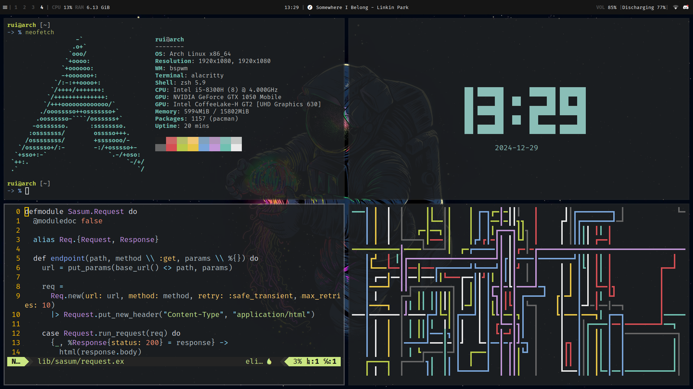

## Welcome to my dotfiles! 🐧

This is a collection of my personal configuration files for various programs and tools that I use on a daily basis. Feel free to use them as is or adapt them to your own needs. If you have any questions or suggestions, please open an issue or a pull request.

### Prerequisites

Before installing the `dotfiles`, make sure you have the following:

1. **Python 3.13+** - required for running the installation script
2. **uv** - modern Python package manager (recommended)
3. **git** - For cloning the repository

#### Installing uv


This project uses [uv](https://docs.astral.sh/uv/) as the Python package manager. Install it with:

```bash
curl -LsSf https://astral.sh/uv/install.sh | sh
```

### Installation

1. **Clone the repository:**
   ```bash
   git clone https://github.com/ruilopesm/dotfiles.git
   cd dotfiles
   ```

2. **Install dependencies with uv:**
   ```bash
   uv sync
   ```

3. **Run the installation script:**
   ```bash
   uv run -m install --machine omen
    
   # without specifying a machine profile
   uv run -m install
   ```

### System



### License

This repository is licensed under the [WTFNMFPL](LICENSE) license.
