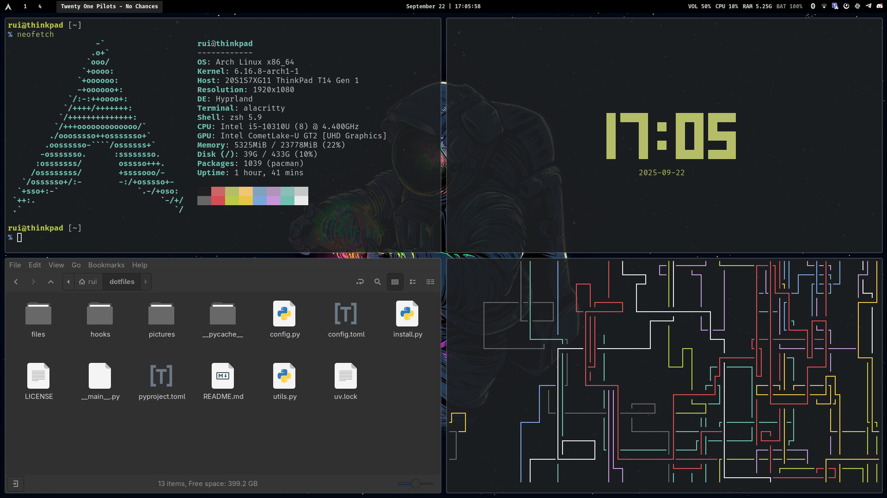

## Welcome to my dotfiles! 🐧

This is a collection of my personal configuration files for various programs and tools that I use on a daily basis. Feel free to use them as is or adapt to your own needs. If you have any questions or suggestions, please open an issue or a pull request.

### Prerequisites

Before installing the `dotfiles`, make sure you have the following:

+ Python 3.13+ and [uv](https://docs.astral.sh/uv/) (recommended for project dependency management)
+ [yay](https://github.com/Jguer/yay) (or any other AUR helper, but you will need to modify the `config.py` script accordingly)

### Installation

1. Clone the repository:

   ```bash
   git clone https://github.com/ruilopesm/dotfiles.git
   cd dotfiles
   ```

> [!NOTE]
> From now on, if `uv` happens to not work, call it from `~/.local/bin/uv`.

2. Install dependencies with uv:

   ```bash
   uv sync
   ```

3. Run the installation script:

   ```bash
   uv run -m install --machine thinkpad
    
   # without specifying a machine profile
   uv run -m install
   ```

### System



> [!NOTE]
> Some configurations inside [files](files) folder are from previous installations, namely Arch with X11 and bspwm. However, I am now using Arch with Wayland and hyprland.

### License

This repository is licensed under the [WTFNMFPL](LICENSE) license.
